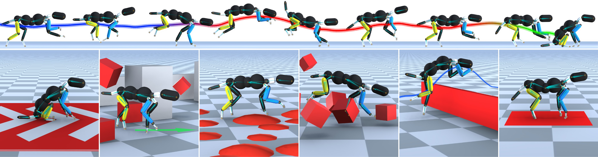

SIGGRAPH ASIA 2021 Technical Communications<br/>
Transition Motion Tensor: A Data-Driven Framework for Versatile and Controllable Agents in Physically Simulated Environments<br >
------------



This paper proposes the Transition Motion Tensor, a data-driven framework that creates physically accurate and novel transitions outside of the motion dataset. It enables the character to grow new motions efficiently and robustly without modifying existing motions. Given several physics-based controllers specializing in different motions, the tensor serves as a guideline for switching between controllers. By querying the tensor for the best transitions, we can create a unified controller capable of producing novel transitions with various behaviors, such as slowing down before higher jumps or jumping immediately for better responsiveness. We apply our framework on both quadrupeds and bipeds, perform quantitative and qualitative evaluations on transition quality, and demonstrate its capability of tackling complex motion planning problems while following user control directives.

Project page: https://inventec-ai-center.github.io/projects/TMT_2021/index.html<br >
Youtube: https://youtu.be/9NzRSZyAOiY<br >
Paper: https://arxiv.org/pdf/2111.15072.pdf


# Installation

## Linux (recommended: Ubuntu 18.04)

1. Install dependencies
``` bash
sudo apt-get update
sudo apt-get install -y vim cmake wget git tar unzip build-essential clang llvm python-dev freeglut3-dev libglew-dev swig python3-pip
```

2. Clone the repository
```bash
git clone --recursive https://github.com/inventec-ai-center/transition_motion_tensor.git
```

3. Install [Eigen](http://eigen.tuxfamily.org/index.php) (version: 3.4.0)
``` bash
cd ~
wget https://gitlab.com/libeigen/eigen/-/archive/3.4.0/eigen-3.4.0.tar.bz2
tar -xf eigen-3.4.0.tar.bz2
cd eigen-3.4.0
mkdir build_cmake
cd build_cmake
cmake ..
sudo make install
```

4. Install [Bullet](https://github.com/bulletphysics/bullet3) (version: 2.88)
``` bash
cd ~
wget https://github.com/bulletphysics/bullet3/archive/2.88.zip
unzip 2.88.zip
cd bullet3-2.88/
vim build_cmake_pybullet_double.sh
# replace -DUSE_DOUBLE_PRECISION=ON with -DUSE_DOUBLE_PRECISION=OFF
./build_cmake_pybullet_double.sh
cd build_cmake
sudo make install
```

5. Install [Open MPI](https://www.open-mpi.org/) (version: 1.10.7)
``` bash
cd ~
wget https://download.open-mpi.org/release/open-mpi/v1.10/openmpi-1.10.7.tar.gz
gunzip -c openmpi-1.10.7.tar.gz | tar xf -
cd openmpi-1.10.7
./configure --prefix=/usr/local
sudo make all install -j8
ldconfig
```

6. Install [Miniconda](https://docs.conda.io/en/latest/miniconda.html)
``` bash
cd ~
wget https://repo.anaconda.com/miniconda/Miniconda3-latest-Linux-x86_64.sh
chmod 777 Miniconda3-latest-Linux-x86_64.sh
./Miniconda3-latest-Linux-x86_64.sh
# restart bash to activate conda
conda create --name env_tmt python=3.7
conda activate env_tmt
```

7. Install python packages
``` bash
cd {TMT_REPO}/TMT # {TMT_REPO} is the path where the TMT repository is located
pip install --upgrade pip
pip install -r requirements.txt
```

8. Modify the Makefile in `TMT/CarlCore/` by specifying the following
    - `EIGEN_DIR`: Eigen include directory
    - `BULLET_INC_DIR`: Bullet source directory
    - `PYTHON_INC`: python include directory
    - `PYTHON_LIB`: python lib directory

9. Compile CarlCore
``` bash
cd {TMT_REPO}/TMT/CarlCore # {TMT_REPO} is the path where the TMT repository is located
make python -j8
```

# How To Use

## Running the code
For convenience, we include the pre-trained models under `TMT/data/policies` and precomputed transition tensors under `TMT/data/trans-tensors`. To run individual template controllers and unified controllers please follow the instructions below.

- Template controller

``` python
# dog-pace
python TMT_Runner.py --arg_file args/run_dog3d_template_controller_pace_args.txt

# dog-trot
python TMT_Runner.py --arg_file args/run_dog3d_template_controller_trot_args.txt

# dog-canter
python TMT_Runner.py --arg_file args/run_dog3d_template_controller_canter_args.txt

# dog-jump
python TMT_Runner.py --arg_file args/run_dog3d_template_controller_jump_args.txt

# humanoid-walk
python TMT_Runner.py --arg_file args/run_humanoid3d_template_controller_walk_args.txt

# humanoid-jog
python TMT_Runner.py --arg_file args/run_humanoid3d_template_controller_jog_args.txt

# humanoid-run
python TMT_Runner.py --arg_file args/run_humanoid3d_template_controller_run_args.txt
```

- Unified controller

``` python
# dog (included pace, trot, canter, and jump motions)
python TMT_Runner.py --arg_file args/run_dog3d_unified_controller_args.txt

# humanoid (included walk, jog, and run motions)
python TMT_Runner.py --arg_file args/run_humanoid3d_unified_controller_args.txt
```

## Training Template Controller

* For dog characters, please follow the instructions from [[carl-siggraph2020]](https://github.com/inventec-ai-center/carl-siggraph2020)
* For humanoid characters, please follow the instructions from [[DeepMimic]](https://github.com/xbpeng/DeepMimic)

## Building Transition Tensor

1. Collecting transition samples
    - `--num_workers `: Number of parallel workers
    - `--num_trajs`: Number of transition samples to collect
    - `--input_filename`: Input argument file
    - `--output_path`: Output path to store transition samples

``` python
# dog
python TMT_Collect_Transitions.py --num_workers 10 --num_trajs 500000 --input_filename args/record_dog3d_transitions_args.txt --output_path "./output/dog_transitions"

# humanoid
python TMT_Collect_Transitions.py --num_workers 10 --num_trajs 500000 --input_filename args/record_humanoid3d_transitions_args.txt --output_path "./output/humanoid_transitions"
```

2. Building transition tensor
    - `--input_path`: Input path where transition samples are located
    - `--alive_thres`: Alive rate threshold (default: `0.9`)
    - `--w_time`: Transition duration weight (default: `1.0`)
    - `--w_stability`: Stability weight (default: `0.015`)
    - `--dt_stability`: Stability neighborhood range (default: `0.01`)
``` python
# dog
python TMT_Build_Transition_Tensor.py --input_path "./output/dog_transitions" --alive_thres 0.9

# humanoid
python TMT_Build_Transition_Tensor.py --input_path "./output/humanoid_transitions" --alive_thres 0.85
```

## Plotting Transition Tensor
We provided a jupyter notebook file `TMT/plot_transition_tensor.ipynb` to visualize the transition tensor. Visit the file for more information.

Note: You'll need to install python package `jupyter` before using the jupyter notebook file `plot_transition_tensor.ipynb`.

# Interface

## General

- Right-click and drag will pan the camera
- Left-click and drag will apply a force on the character at a particular location
- Scroll wheel will zoom in/out
- Pressing 'r' will reset the episode
- Pressing 'l' will reload the argument file and rebuild everything
- Pressing 'g' will start/stop video recording (required `ffmpeg`)
- Pressing space will pause/resume the simulation
- Pressing '>' will step the simulation one step at a time
- Pressing 'x' will pelt the character with random boxes

## Unified Controller

### Dog
- Pressing 'q' will switch to canter motion
- Pressing 'e' will switch to jump motion
- Pressing 'a' or 'd' will switch to pace motion and control the heading
- Pressing 'w' will switch to trot motion

### Humanoid
- Pressing '1' will switch to walk motion
- Pressing '2' will switch to jog motion
- Pressing '3' will switch to run motion

# Known Issues and Solutions

Q: Crash with message `"util/MathUtil.cpp:175: static tMatrix cMathUtil::RotateMat(const tVector &, double): Assertion std::abs(axis.squaredNorm() - 1) < 0.0001' failed."` after throwing random boxes.

A: You can adjust the equation `std::abs(axis.squaredNorm() - 1) < 0.0001` in file `DeepMimic/DeepMimicCore/util/MathUtil.cpp`, from value `0.0001` to `0.1`, and re-compile CarlCore.

Q: Getting the error message `ImportError: libBulletDynamics.so.2.88: cannot open shared object file: No such file or directory` while running the codes.

A: Check `libBulletDynamics.so.2.88` is presented under `/usr/local/lib/` by running `ls -l /usr/local/lib/ | grep libBullet`, and then include it in the PATH by running `export LD_LIBRARY_PATH=/usr/local/lib/`.

# Acknowledgement

We thank [AI4Animation](https://github.com/sebastianstarke/AI4Animation) for providing the quadruped animation system and [DeepMimic](https://github.com/xbpeng/DeepMimic/tree/06e5b371bb1fce4e37607bf958b2473ed4117520) for providing the motion imitation framework and pre-trained humanoid policies.


# Copyright Information

This project is under the terms of [the MIT license](https://opensource.org/licenses/mit-license.php). It is only for research or education purposes, and not freely available for commercial use or redistribution. This intellectual property belongs to the Inventec Corporation. Licensing is possible if you want to use the code for commercial use. For scientific use, please reference this repository together with the relevant publication.

```
@article{TMT2021,
	author 	   = {Soeseno, Jonathan Hans and Luo, Ying-Sheng and Chen, Trista Pei-Chun and Chen, Wei-Chao},
	title 	   = {Transition Motion Tensor: A Data-Driven Approach for Versatile and Controllable Agents in Physically Simulated Environments},
	journal    = {SIGGRAPH Asia 2021 Technical Communications},
	year 	   = {2021},
	numpages   = {4},
}
```
